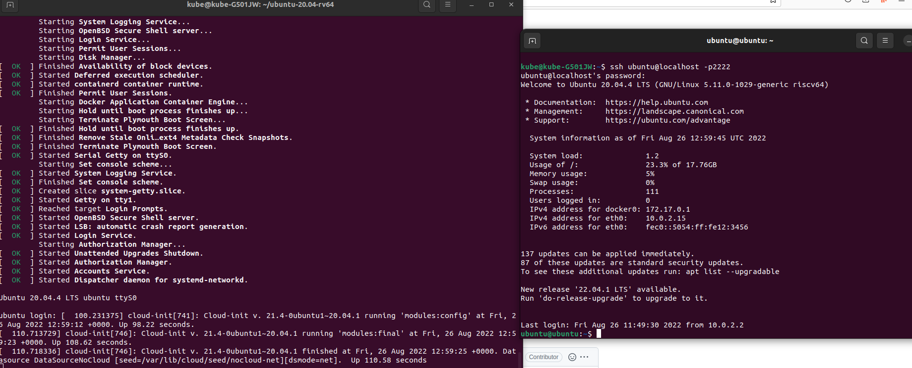
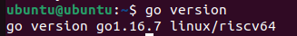
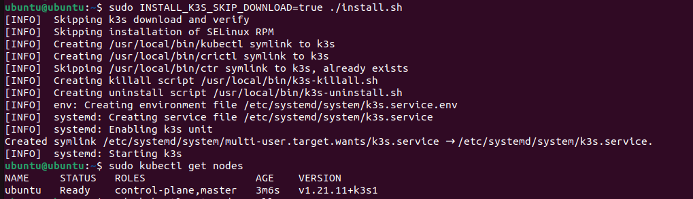

## Preparing the Host OS and Installing QEMU

```bash
:~$ cd ~ 
# Install QEMU's dependencies
:~$ sudo cp /etc/apt/sources.list /etc/apt/sources.list~ 
:~$ sudo sed -Ei 's/^# deb-src /deb-src /' /etc/apt/sources.list 
:~$ sudo apt update
:~$ sudo apt install ninja-build u-boot-qemu opensbi 
:~$ sudo apt build-dep qemu
# Make the QEMU binary to emulate the riscv64 architecture
:~$ git clone https://git.qemu.org/git/qemu.git 
:~$ cd qemu
:~/qemu$ git checkout v6.2.0 
:~/qemu$ ./configure --target-list=riscv64-softmmu --enable-virtfs 
:~/qemu$ make –j4 
:~/qemu$ sudo mv /etc/apt/sources.list~ /etc/apt/sources.list 
```

## Ubuntu image

```bash
# Download riscv64 Ubuntu image
:~$ cd ~ 
:~$ sudo apt install wget -y
:~$ wget "https://cdimage.ubuntu.com/releases/20.04.4/release/ubuntu-20.04.4-preinstalled-server-riscv64+unmatched.img.xz" -O ubuntu-20.04-riscv64.img.xz
:~$ mkdir ubuntu-20.04-rv64
:~$ cd ubuntu-20.04-rv64
:~/ubuntu-20.04-rv64$ xz -dk ../ubuntu-20.04-riscv64.img.xz
# Download script to run the image using QEMU
:~/ubuntu-20.04-rv64$ wget https://github.com/chefmtt/riscv64/releases/download/v0.1/run-ubuntu.sh
:~/ubuntu-20.04-rv64$ chmod +x run-ubuntu.sh
# Optionnal : resize the image, to increase available disk space in the virtual machine
:~/ubuntu-20.04-rv64$ sudo apt install qemu-utils
:~/ubuntu-20.04-rv64$ qemu-img resize -f raw ubuntu-20.04-riscv64.img +15G
```

You now have access to the virtual machine (VM) by using the run.sh script.

```bash
:~/ubuntu-20.04-rv64$ ./run-ubuntu.sh
```

You can ssh into the VM. This provides a better terminal experience (no visual glitch mainly) but is optionnal. Open a new terminal :

```bash
:~$ ssh ubuntu@localhost -p2222 # The connection will be refused until the VM has fully started : just wait a minute and retry.
```
Connect using the default user and password.  
`User : ubuntu`  
`Password : ubuntu`  

On your first startup, you will be prompted to change the default password. Follow the instructions in the prompt.

Once you are connected, this is the expected output :  
(VM on the left, ssh connection to the VM on the right)



## The following instructions are run in the virtual machine.

### Installing GO

```bash
# Upgrade software and install tools to download and extract files
:~$ sudo apt update && sudo apt upgrade -y
:~$ sudo apt install wget -y && sudo apt install xz-utils
# Download and extract the Go binary
:~$ wget https://github.com/carlosedp/riscv-bringup/releases/download/v1.0/go1.16.7.linux-riscv64.tar.gz 
:~$ sudo tar vxf go1.16.7.linux-riscv64.tar.gz -C /usr/local
# Export to path to launch Go binary from anywhere
:~$ export PATH="/usr/local/go/bin:$PATH"
:~$ echo "export PATH=/usr/local/go/bin:$PATH" >> ~/.bashrc
# Check that everything went well :
:~$ go version
```
Your output should look like this :


### Installing glibc-2.33 and patchELF (needed to run Dokcer)

```bash
# Download glibc-2.33 compiled for Ubuntu 20.04, to run dinamically linked binaries compiled against it
:~$ wget https://github.com/chefmtt/riscv64/releases/download/v0.1/glibc-2.33.tar.xz
:~$ mkdir $HOME/lib
:~$ tar -vxf glibc-2.33.tar.xz -C $HOME/lib
# Download and install patchELF, to specify which libs should a binary use
:~$ wget https://github.com/chefmtt/riscv64/releases/download/v0.1/patchELF-riscv64.tar.xz
:~$ sudo tar -xvf patchELF-riscv64.tar.xz -C /usr/local
:~$ sudo chmod +x /usr/local/bin/patchelf
```

### Installing Docker

```bash
# Install Docker package
:~$ wget https://github.com/carlosedp/riscv-bringup/releases/download/v1.0/docker-v20.10.2-dev_riscv64.deb 
:~$ sudo apt install -y ./docker-v20.10.2-dev_riscv64.deb
# Patch binaries used by docker to use the glibc-2.33 install
:~$ patchelf --set-rpath /home/ubuntu/lib/glibc-2.33-install/lib --set-interpreter /home/ubuntu/lib/glibc-2.33-install/lib/ld-linux-riscv64-lp64d.so.1 /usr/local/sbin/runc
:~$ patchelf --set-rpath /home/ubuntu/lib/glibc-2.33-install/lib --set-interpreter /home/ubuntu/lib/glibc-2.33-install/lib/ld-linux-riscv64-lp64d.so.1 /usr/local/bin/ctr
:~$ patchelf --set-rpath /home/ubuntu/lib/glibc-2.33-install/lib --set-interpreter /home/ubuntu/lib/glibc-2.33-install/lib/ld-linux-riscv64-lp64d.so.1 /usr/local/bin/containerd
# Reboot to allow systemd services to start
:~$ sudo reboot
# Verify the installation by launching a test image
:~$ sudo docker run hello-world
```
Your output should look like this :  


(Optionnal) By default, you need to run docker as sudo. To add permissions to another user, run :

```bash
sudo usermod -aG docker <USER> # Replace by your user name
```

### Installing K3s

```bash
# Download K3s v1.21.11+k3s1 and install it
:~$ wget https://github.com/chefmtt/riscv64/releases/download/v0.1/k3s-1.21.11+k3s1-riscv64
:~$ chmod +x k3s-1.21.11+k3s1-riscv64
:~$ mv k3s-1.21.11+k3s1-riscv64 /usr/local/bin/k3s
:~$ wget https://raw.githubusercontent.com/k3s-io/k3s/v1.21.11%2Bk3s1/install.sh
:~$ chmod +x install.sh
:~$ sudo INSTALL_K3S_SKIP_DOWNLOAD=true ./install.sh
# To validate the installation
:~$ sudo kubectl get nodes
```
Your output should look like this, during the installation and when fetching nodes :  


